# Calculator
> The purpose of this Hello World is the development of a backend calculator with the following basic functions:

Open a browser and go to http://localhost:5000/info.


This GitHub repository/workflow and will be responsible for the following tasks:

* Build each operation of the calculator
* Executes the unit testing 
* Execute the SonarQube and Snyk testing
* Delivery the aplication as a Helm Package to a selected registry

The following options will be available when executing this POC:

1. The cloud to be used: <span style="color: chocolate;">AWS, GCP or Azure</span>.<br>
2. The CD solution: 

<br>

## Infra Structure - Resources that are expected to be provisioned manually.

Here we will describe all the resources that should be already provisioned for each cloud where this POC is able to work with.<br>

> GCP

<span style="color: pink;">Project (ID)</span>: A project should be already created on the GCP account and the PROJECT_ID should be stored on the GitHub variable <span style="color: chocolate;">GOOGLE_CREDENTIALS</span>. Example: <span style="color: chocolate;">decio-440716</span>.<br>
<span style="color: pink;">Service Account Json Key</span>: A Service Account Json Key should be created with all required access to run the workflow. I created a SA on my, personal GCP account, called <span style="color: chocolate;">my-github-sa</span>. This SA has owner access to the Project ID <span style="color: chocolate;">decio-440716</span>. The contents of the JSON Key File generated should be saved on the GitHub variable <span style="color: chocolate;">GOOGLE_CREDENTIALS</span>. The Apendix A describes how to create the SA Key using the GCP UI.<br>
<span style="color: pink;">APIs enabled</span>: Remember to enable at least the following APIs on the new project created:<br>
<span style="color: green;">
 gcloud services enable compute.googleapis.com<br>
 gcloud services enable artifactregistry.googleapis.com<br>
</span> 


> Azure

<span style="color: pink;">Resource Group (rg)</span>: A resource group should be already created and it´s name stored on the variable: <span style="color: chocolate;">AZURE_RESOURCE_GROUP</span>. Example: <span style="color: chocolate;">rg-calculator</span><br>
<span style="color: pink;">Service Principal (sp)</span>: The Apendix B describes how to create the Applications Key using the Azure UI.<br>

<br>

## All Clouds - Common variables used by all the Clouds.

Here we will describe all the variables that are required to be defined despite the CLOUD_NAME defined.<br>

<span style="color: pink;">CLOUD_NAME</span>: This is the name of the cloud where the applications will have the Docker Image and Helm Chart delivered to. May assume the following values: <span style="color: chocolate;">AWS</span>, <span style="color: chocolate;">GCP</span> and <span style="color: chocolate;">Azure</span>.<br>
<span style="color: pink;">PREFIX_NAME</span>: This is prefix that will be used to create the repository name for Docker and Helm. The final Registry name will be slightly different from cloud to cloud becouse of the way each one works (ECR, GAR or ACR). Normally we will use <span style="color: chocolate;">calculator</span>. <br>
<span style="color: pink;">ADD_SUFFIX_NAME</span>: This is sufix that will be used to create the repository image for Docker and Helm for the addition calculator operation. Normally we will use <span style="color: chocolate;">addition</span>. <br>
<span style="color: pink;">SUB_SUFFIX_NAME</span>: This is sufix that will be used to create the repository image for Docker and Helm for the subtraction calculator operation. Normally we will use <span style="color: chocolate;">subtraction</span>. <br>
<span style="color: pink;">DIV_SUFFIX_NAME</span>: This is sufix that will be used to create the repository image for Docker and Helm for the division calculator operation. Normally we will use <span style="color: chocolate;">division</span>. <br>
<span style="color: pink;">MUL_SUFFIX_NAME</span>: This is sufix that will be used to create the repository image for Docker and Helm for the multiplication calculator operation. Normally we will use <span style="color: chocolate;">division</span>. <br>
<br>

## AWS - Required GitHub Secrets and Variables

Here we will describe all variables and secrets required when the cloud to deploy the application calculator is the AWS.<br>

<span style="color: pink;">PAT_DECIO_GITHUB</span>: to hold your PAT(Personal Access Token) with all the required access to run the pipeline. If you have your own PAT available on GitHub, you may just change the actual PAT_DECIO_GITHUB with your secret on the .github/workflows.<br>

<span style="color: pink;">TF_TOKEN_APP_TERRAFORM_IO</span>: This secret is used to authenticate Terraform Cloud or Terraform Enterprise when running Terraform commands. It stores the personal access token that grants access to your Terraform Cloud or Terraform Enterprise account.
<span style="color: pink;">PREFIX_NAME</span>: This is a prefix used on the deployments to compose the many resources being created by this workflow.

### Required Secrets

<span style="color: pink;">AWS_ACCESS_KEY_ID</span>: This is your AWS access key ID. This access key ID, along with a corresponding secret access key, is used to authenticate and authorize requests made to AWS services via the AWS Command Line Interface (CLI).If you have your own AWS_ACCESS_KEY_ID available on GitHub, you may just change the actual AWS_ACCESS_KEY_ID with your secret on the .github/workflows.<br>
<span style="color: pink;">AWS_SECRET_ACCESS_KEY</span>: This is your AWS secret access key. If you have your own AWS_SECRET_ACCESS_KEY available on GitHub, you may just change the actual AWS_SECRET_ACCESS_KEY with your secret on the .github/workflows.<br>


### Required Variables

<span style="color: pink;">AWS_REGION</span>: The region used to create the resources. The same region as the one used to create the infra structure.<br>
<span style="color: pink;">ACCOUNT_ID</span>: This is the AWS AccountID where the resources will be deployed.<br>
<br>

## GCP - Required GitHub Secrets and Variables

Here we will describe all variables and secrets required when the cloud to deploy the application calculator is the AWS.<br>

### Required Secrets

<span style="color: pink;">GOOGLE_CREDENTIALS</span>: This secret is used to hold the key of a GCP Service Account that will be used for running the workflows. This is not aligned with the best practices (as defined on APENDIX J – GCP documentation on the most used of the document GitHub - Actions.docx ), but will simplify the calculator POC despite the risks of having a long term key as a secret.<br>
<span style="color: red;">NOTE</span>: The json content to create the secret may be found on my container on the file: <span style="color: chocolate;">GCP-my-github-sa.txt</span>

### Required Variables

<span style="color: pink;">GCP_REGION</span>: The region (location) used to create the Artifact Registry. The same region as the one used to create the infra structure. Example: southamerica-east1<br>
<span style="color: pink;">GCP_PROJECT_ID</span>: This is the GCP Project ID.<br>

<br>

## Azure - Required GitHub Secrets and Variables when using Login with Client Secret

Here we will describe all variables and secrets required when the cloud to deploy the application calculator is the Azure.<br>

### Required Secrets

<span style="color: pink;">AZURE_CREDENTIALS</span>: The Subscription ID refers to the Azure subscription you want to target. To find it, use the following command:<br>

```json
{
      "clientId": "<Client ID>",
      "clientSecret": "<Client Secret>",
      "subscriptionId": "<Subscription ID>",
      "tenantId": "<Tenant ID>"
}
```
<span style="color: red;">NOTE</span>: The json content to create the secret may be found on my container on the file: <span style="color: chocolate;">Azure-Full-Access-Service-Principal.txt</span>

<span style="color: pink;">AZURE_CLIENT_ID</span>: This is the clientID as specified on the JSON above used to create the AZURE_CREDENTIALS secret. This specific secret is used by the <span style="color: chocolate;">docker/login-action@v3 action</span>.<br>
<span style="color: pink;">AZURE_CLIENT_SECRET</span>: This is the clientSecret as specified on the JSON above used to create the AZURE_CREDENTIALS secret. This specific secret is used by the <span style="color: chocolate;">docker/login-action@v3 action</span>.<br>

### Required Variables

<span style="color: pink;">AZURE_REGION</span>: An Azure location, also referred to as a region, is a physical datacenter (or a group of datacenters) within a specific geographic area where Microsoft Azure offers its cloud services.. Example: brazilsouth<br>
<span style="color: pink;">AZURE_RESOURCE_GROUP</span>: This is Azure Resource Group name where the ACR (Azure Container Registry) should be created.<br>

<br>

## Azure - Required GitHub Secrets and Variables when using OIDC (The best Practice)

Here we will describe all variables and secrets required when the cloud to deploy the application calculator is the Azure.<br>
To set the Cloud as AWS just set the following variable:<br>

<span style="color: pink;">CLOUD_NAME</span>: <span style="color: green;">Azure</span><br>


### Required Secrets (When Using OIDC)

<span style="color: pink;">AZURE_CLIENT_ID</span>: This secret is the <span style="color: chocolate;">appID</span> that is the resulting from the command to create a Service Principal on Microsoft Entra as described (as defined on APENDIX K – Azure documentation on the most used of the document GitHub - Actions.docx ).<br>
<span style="color: pink;">AZURE_TENANT_ID</span>: This secret is the <span style="color: chocolate;">tenant</span> that is the resulting from the command to create a Service Principal on Microsoft Entra as described (as defined on APENDIX K – Azure documentation on the most used of the document GitHub - Actions.docx ).<br>
<span style="color: pink;">AZURE_SUBSCRIPTION_ID</span>: The Subscription ID refers to the Azure subscription you want to target. To find it, use the following command:<br>
<span style="color: green;">az account show --query id --output tsv</span><br>

### Required Variables

<span style="color: pink;">AZURE_LOCATION</span>: An Azure location, also referred to as a region, is a physical datacenter (or a group of datacenters) within a specific geographic area where Microsoft Azure offers its cloud services.. Example: brazilsouth<br>
<span style="color: pink;">AZURE_RESOURCE_GROUP</span>: This is Azure Resource Group name where the ACR (Azure Container Registry) should be created.<br>

<br>

## Helm Charts - variables used to customize Helm Chart per operation.

Here we will describe all the variables that is used to customize each operation of the calculator.<br>

> addition <br>

<span style="color: pink;">SVCTYPE_ADD</span>: This .<br>
<span style="color: pink;">SVCTYPE_SUB</span>: This .<br>
<span style="color: pink;">SVCTYPE_DIV</span>: This .<br>
<span style="color: pink;">SVCTYPE_MUL</span>: This .<br>
<br>
<span style="color: pink;">CONTAINER_PORT_ADD</span>: This .<br>
<span style="color: pink;">CONTAINER_PORT_SUB</span>: This .<br>
<span style="color: pink;">CONTAINER_PORT_DIV</span>: This .<br>
<span style="color: pink;">CONTAINER_PORT_MUL</span>: This .<br>
<br>
<span style="color: pink;">PORT_ADD</span>: This .<br>
<span style="color: pink;">PORT_SUB</span>: This .<br>
<span style="color: pink;">PORT_DIV</span>: This .<br>
<span style="color: pink;">PORT_MUL</span>: This .<br>
<br>
<span style="color: pink;">ALBSCHEME_ADD</span>: This .<br>
<span style="color: pink;">ALBSCHEME_SUB</span>: This .<br>
<span style="color: pink;">ALBSCHEME_DIV</span>: This .<br>
<span style="color: pink;">ALBSCHEME_MUL</span>: This .<br>

> subtraction

> division

> multiplication


<br>

## The Endpoints of Each Operation

<br>

Application | Language | Package |Apl URL | Healthy Check URL
-|-|-|-|-
addition | C# | NuGet | http://localhost:5174/sum?x=3&y=5 | http://localhost:5174/Healthcheck
division | Node | npm | http://localhost:3000/divide?x=10&y=2 | http://localhost:3000/Healthcheck
multiplication | Java| Maven | http://localhost:8080/multiplication?x=3&y=5 | http://localhost:8080/Healthcheck
subtraction | Python | pip3 | http://localhost:5175/subtract?x=3&y=5 | http://localhost:5175/Healthcheck

<br>

## Running each application on the desktop

<br>

> Addition

```bash
cd /workspaces/calculator/addition
dotnet build
dotnet run
```

> Division

```bash
cd /workspaces/calculator/division
node index.js
```

> Multiplication

```bash
cd /workspaces/calculator/multiplication
mvn clean install
mvn spring-boot:run
```

> Subtraction

```bash
cd /workspaces/calculator/subtraction
python3 app.py
```

<br>

## The existing scripts to help the use of this POC

I created some scripts to help the preparation, stop, run and cleanning of the operations on your local desktop.
<br>


### Running the calculator
To execute a fresh new calculator, you should run the following scripts/rebuild: <br>

> <span style="color: green;">clear-calculator</span>: To guarantee that nothing was left behind on the Repo after the last execution.<br>
> <span style="color: chocolate;">Rebuild the Container</span>: To clean-up enntire Ubuntu image.<br>
> <span style="color: green;">prepare-calculator</span>: To install all required compiler/packages for all languages on the calculator.<br>
> <span style="color: green;">run-calculator</span>: To run , in backgrounnd, all to operations of the calculator.


### Testing the calculator

To all the operations on the calculator, we can use all the URLs listed on the EndPoints Table, or use the saved operations on Insomnia as illustrated bellow: <br>

<div style="border: 1px solid gray; display: inline-block; margin-left: 0px;">
    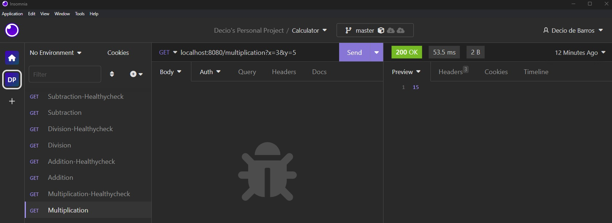
</div>

<BR>

## Stop all the running operations

Instead of tryign to develop a script to stop all the proceess created by the <span style="color: green;">run-calculator</span>, i realized that the best approach to celan-up evething is to execute the following rebuild/script:
<br>

> <span style="color: green;">clear-calculator</span>: To guarantee that nothing was left behind on the Repo after the last execution.<br>
> <span style="color: chocolate;">Rebuild the Container</span>: To clean-up enntire Ubuntu image.<br>

<BR>

## The available options for running this POC

Instead of tryign to develop a script to stop all the proceess created by the <span style="color: green;">run-calculator</span>, i realized that the best approach to celan-up evething is to execute the following rebuild/script:


<br>

## APENDIX A - Creating a GCP SA JSON Key
To create a Service Account on the GCP Account, follow the steps described bellow:

<div style="border: 1px solid gray; display: inline-block; margin-left: 0px;">
    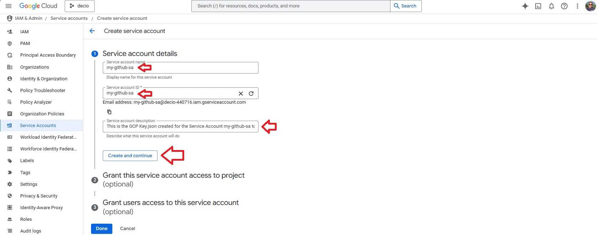
</div>

<br>

<div style="border: 1px solid gray; display: inline-block; margin-left: 0px;">
    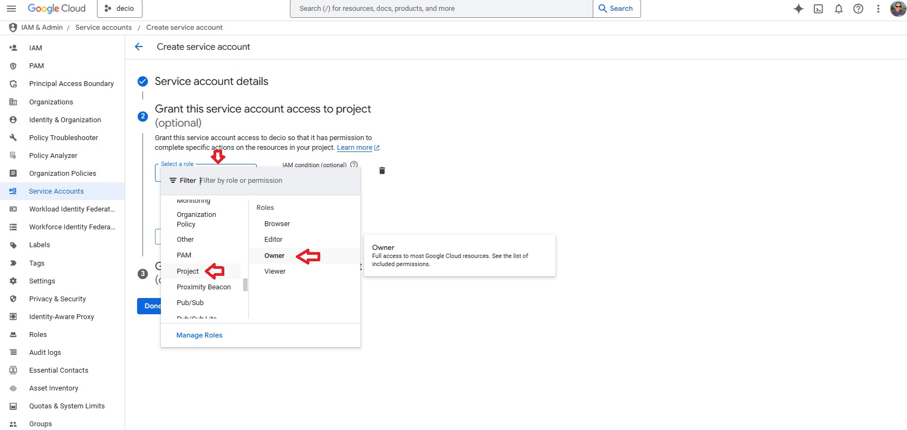
</div>

<br>

<div style="border: 1px solid gray; display: inline-block; margin-left: 0px;">
    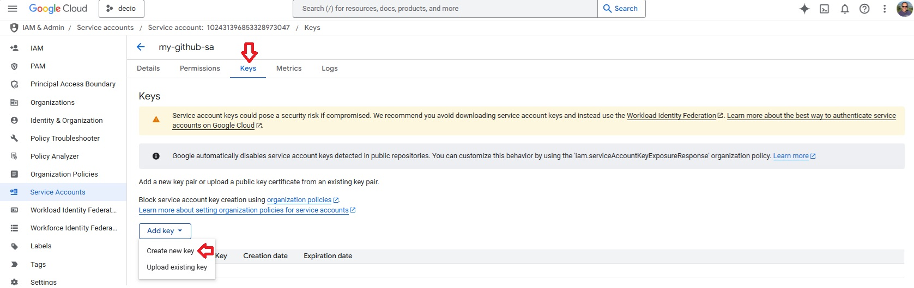
</div>

<br>

<div style="border: 1px solid gray; display: inline-block; margin-left: 0px;">
    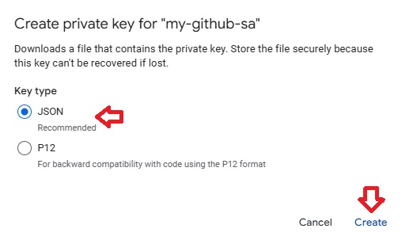
</div>

<br>

The New JSON File Key will be created and downloaded automatically to your computer. Keep it on a safe place and add it as a secret on GitHub.

<br>

## APENDIX B - Registering a new application with Azure

Step 1 - Access the <span style="color: chocolate;">Microsoft Entra</span> and select the option <span style="color: chocolate;">App registrations</span>.

<div style="border: 1px solid gray; display: inline-block; margin-left: 0px;">
    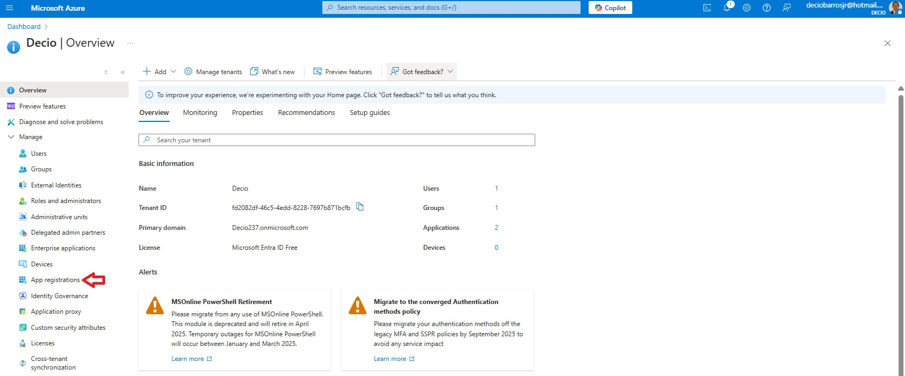
</div>

<br>

Step 2 - On the next screen select the tab <span style="color: chocolate;">All applications</span> and then click on the <span style="color: chocolate;">New registrantion</span> link as illustrated bellow:

<br>

<div style="border: 1px solid gray; display: inline-block; margin-left: 0px;">
    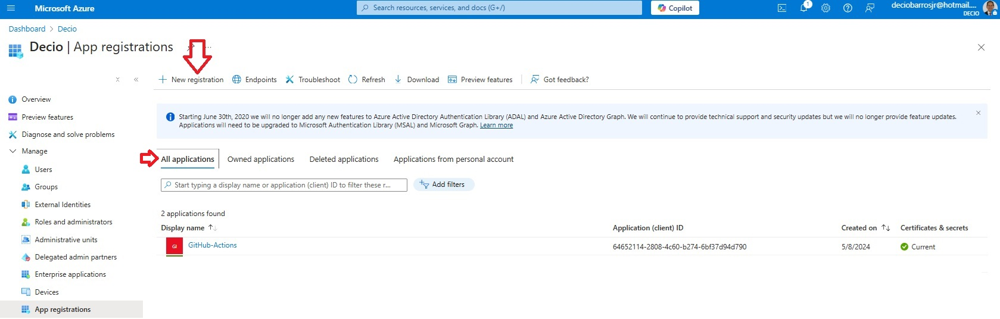
</div>

<br>

Step 3 - Create the Application registry as illustrated by the following image:

<br>

<div style="border: 1px solid gray; display: inline-block; margin-left: 0px;">
    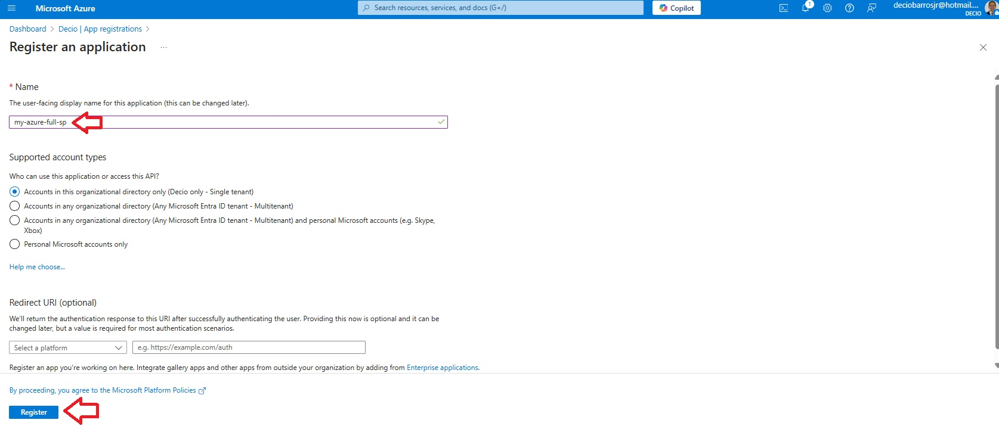
</div>

<br>

Step 4 - Select the <span style="color: chocolate;">Certificates & Secrets</span> on the left panel and the <span style="color: chocolate;">New client secret</span> to create the secrets to access the application.

<br>

<div style="border: 1px solid gray; display: inline-block; margin-left: 0px;">
    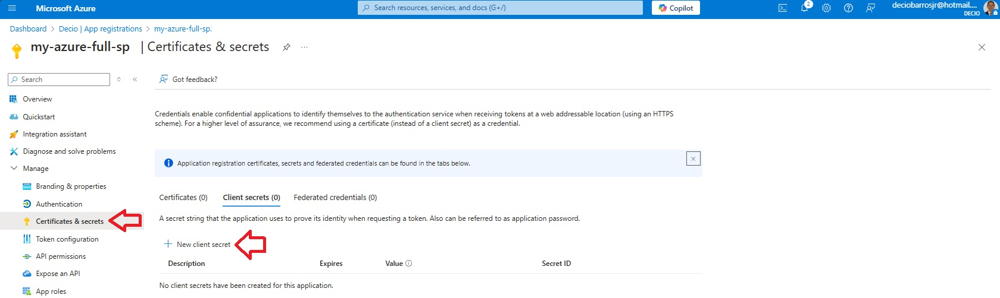
</div>

<br>

Step 5 - Fill in the Description and choose the Expiring period for the cliente secret. The secret created on 15/03/2025 will expire after 24 months. Click <span style="color: chocolate;">Add</span> to create the secret.

<br>

<div style="border: 1px solid gray; display: inline-block; margin-left: 0px;">
    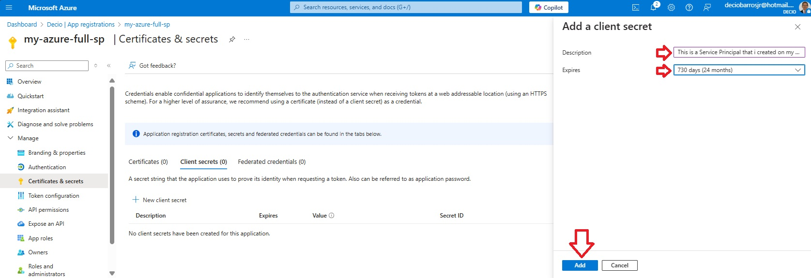
</div>

<br>

Step 6 - Copy the Click <span style="color: chocolate;">Value</span> and Click <span style="color: chocolate;">Secret ID</span> and keep it on a safe place. These information will be used to create the Click <span style="color: chocolate;">AZURE_CREDENTIALS</span> to be stored on the GitHub Secrets.

<br>

<div style="border: 1px solid gray; display: inline-block; margin-left: 0px;">
    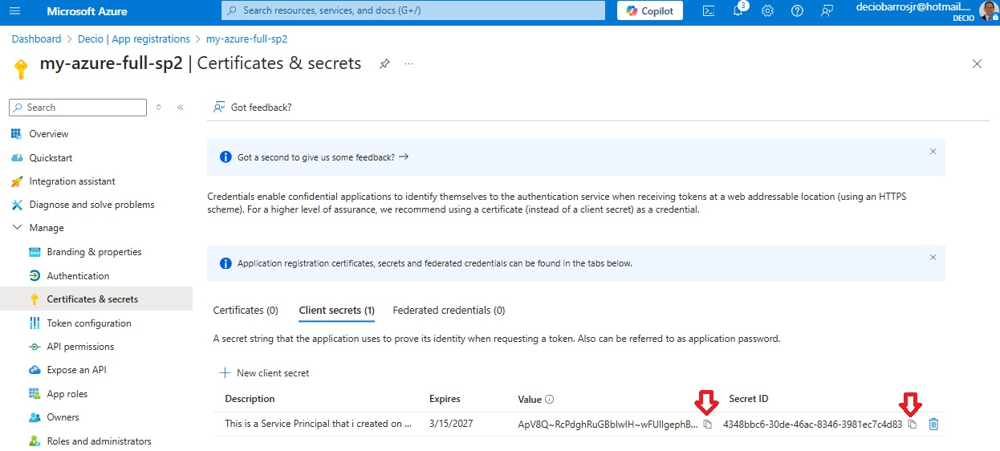
</div>

<br>

Step 7 - Once the secrets are created, the <span style="color: chocolate;">App registrations screen</span> will looks like the following:

<br>

<div style="border: 1px solid gray; display: inline-block; margin-left: 0px;">
    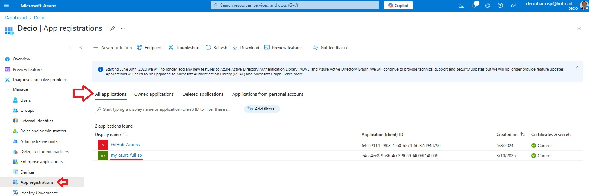
</div>

<br>

Step 8 - As detailed on the <span style="color: chocolate;">Azure - Required GitHub Secrets and Variables when using Login with Client Secret</span>, it´s necessary to create a secret to store on GitHub Secret with the following format:

```json
{
      "clientId": "<Secret ID>",
      "clientSecret": "<Value>",
      "subscriptionId": "<Subscription ID>",
      "tenantId": "<Tenant ID>"
}
```
<br>
The <span style="color: chocolate;">clientID</span> and the <span style="color: chocolate;">clientSecret</span> was obtainet on the Step 6 of this procedure. The <span style="color: chocolate;">subscriptionId</span> and <span style="color: chocolate;">tenantId</span> may be checked on the Azure UI or using the followingg commands:<br><br>

subscriptionId: <span style="color: green;">az account show --query id --output tsv</span>.<br>
tenantId: <span style="color: green;">az account show --query tenantId --output tsv</span>.<br>
