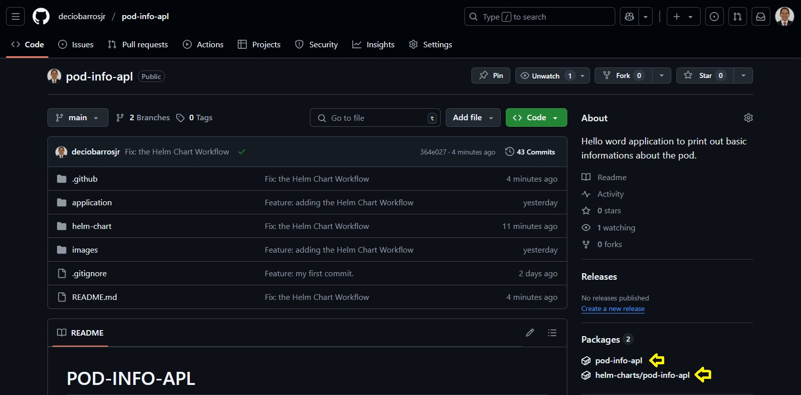
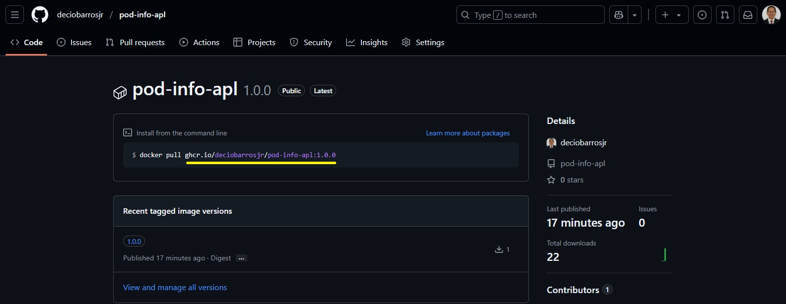
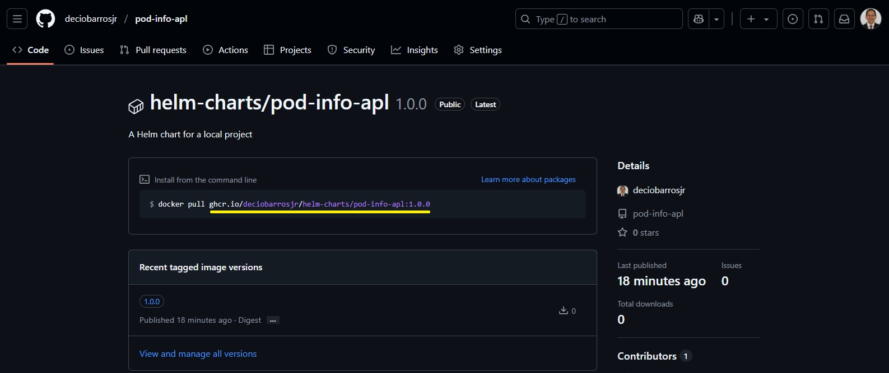

# POD-INFO-APL
This POC is responsible for publishing the pod-info-apl application image and the helm chart on the GitHub Registry to be used by any kubernetes for testing and learning purposes. 
The purpose of this Hello World application is replying information about a POD when the route /info is called. 

 

## Repository - GitHub Configurations to use Registry.

All that is required is a GitHub Free Tier Personal Account with the required configuration to allow the registry use on it. 
Some important restrictions should pointed out about the GitHub Free Tier:

 

> The project should be public in order to be able to use the registry as illustrated bellow:

    

 

> The following GitHub actions are used by the workflow:
./.github/actions/get-app-version

## Repository Variables and Secrets.

PAT_DECIO_GITHUB: This is my Personal Access Token to give the required access rights to the worflow in order to push the imahe and helm chart to the GitHub Registry. It´s located on the MODELO-DE-CONTAINER/decio/.ssh. 
verbose: (default= false) This is a boolean variable that defines if the workflows should prin out more detailed information during it´s execution. 

## Workflow.

A very simple workflow (pod-info-apl/.github/workflows/build.yml) is responsible for the application image building, image pushing to GitHub Registry and the Helm Chart customization and pushing to the GitHub Registry. 
> Workflow Trigger 

This workflow will be triggered on any push to the main branch on the repository pod-info-apl. 

> Application version change 

This is a very simple application and probably will not require any additional functionality. Just in case it´s requires, the variable __version__ on the file pod-info-apl/application/app.py should be changed and the change be commited/pushed again to the main branch.

 

## Repository - Checking the image and Helm Chart published.

Bellow a illustration of where your Application Image and Helm Chart are published.
 
NOTE: On a production environment, the best aproach would be publishing the Helm Chart on the GitHub Pages using the helm/chart-releaser-action@v2 module.

    

 

Clicking on any of the links will bring to you the package page with the address to use it: 

    

 

    

 